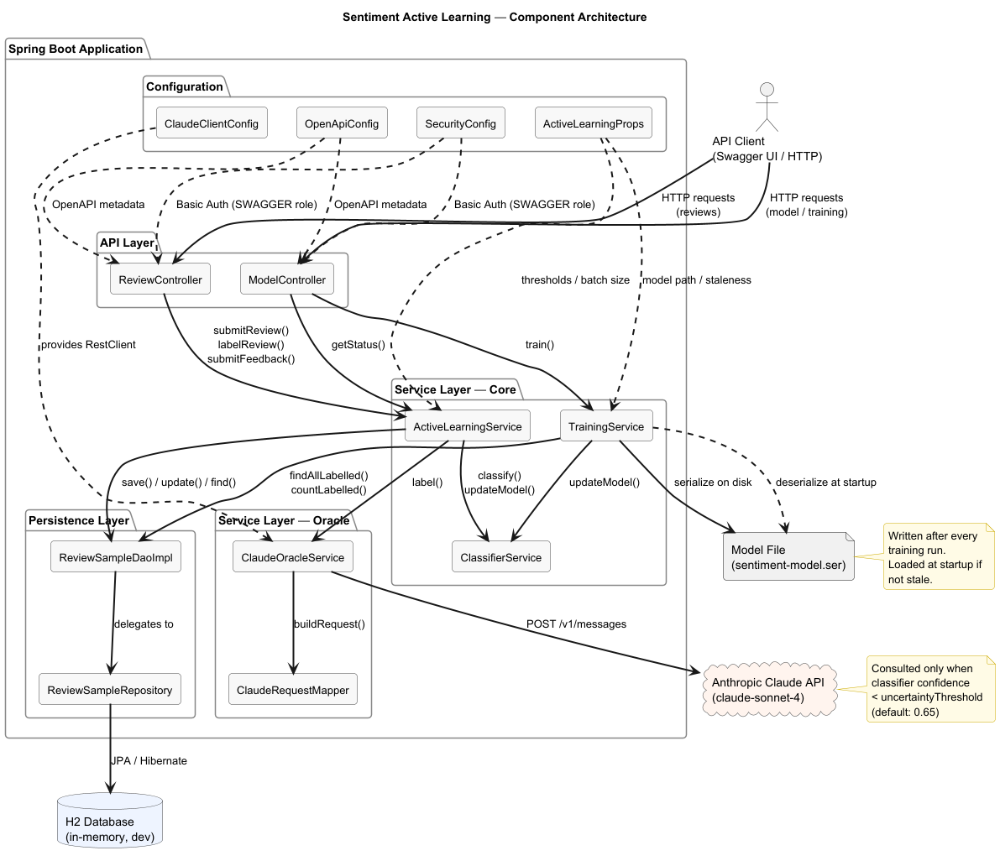
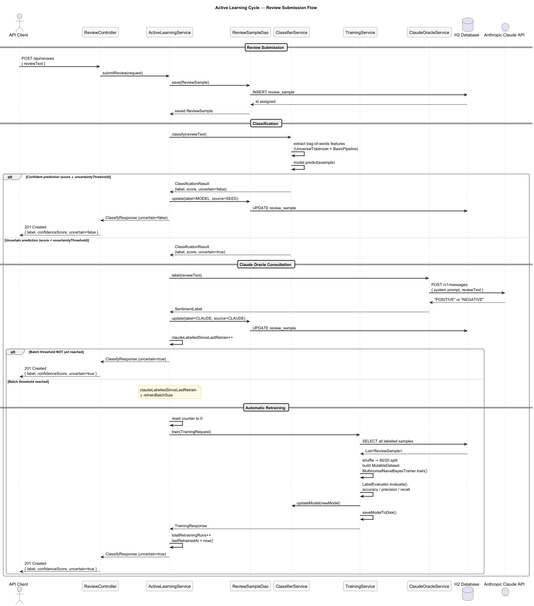
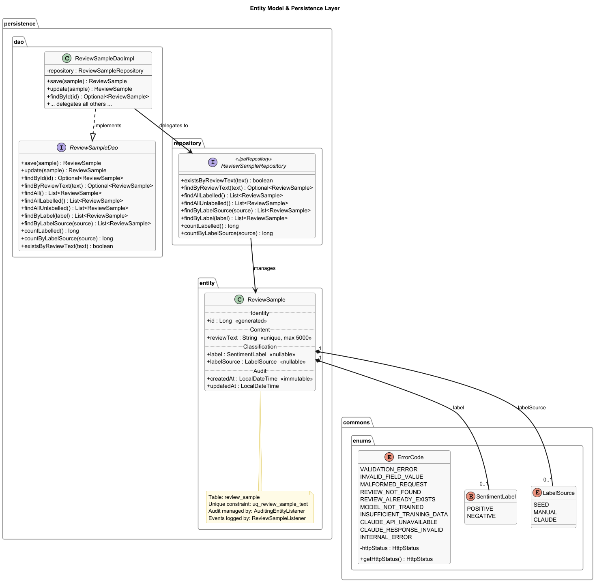
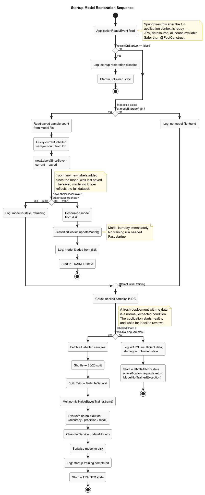

# Sentiment Active Learning

<p align="center">
<a href="https://github.com/AngelaMariaDespotopoulou/java-spring-sentiment-active-learning/releases"></a>
</p>

A Java Spring Boot application that classifies movie review sentiment using a Naive Bayes model built with Oracle's Tribuo library. Features a full active learning cycle: the model detects its own uncertainty, consults Claude AI as an oracle for labelling, and retrains itself continuously to improve.

[](https://openjdk.org/)
[](https://spring.io/projects/spring-boot)
[](https://tribuo.org/)
[](https://www.anthropic.com/)
[](LICENSE.md)
[](https://hub.docker.com/u/amdespotopoulou)

---

## 📌 What This Project Does

Given a movie review in plain English, this application answers one question:

> **Is this review positive or negative?**

It does so using a Multinomial Naive Bayes classifier trained on labelled review texts. What makes it interesting is the feedback loop built around that classifier — the **active learning cycle** — which continuously improves the model without requiring manual retraining or a data scientist to intervene.

---

## 💡 Business Value

### The Problem with Static ML Models

Most ML-powered applications deploy a model, and that model stays frozen. Over time, the vocabulary of reviews shifts — new slang emerges, cultural references change, edge cases accumulate. The frozen model degrades silently. Nobody notices until a significant drop in quality becomes impossible to ignore.

Retraining requires collecting new labelled data, which requires human effort, which costs money and time.

### The Active Learning Solution

This application closes the feedback loop automatically:

1. **The model classifies reviews it is confident about for free.** No human involvement, no API cost.
2. **When the model is uncertain, it asks Claude AI instead of guessing.** A wrong confident prediction is worse than admitting uncertainty.
3. **Every oracle answer becomes a new training example.** The model learns from its own uncertainty.
4. **When enough new examples accumulate, the model retrains itself.** The improvement happens automatically, in the background, without deployment.

The result is a system that gets better the more it is used — a compounding return on the initial investment in labelled seed data.

### Practical Applications

- Content moderation pipelines that need to handle evolving language
- Customer feedback classification at scale
- Any domain where sentiment signals drive business decisions and labelled data is expensive to produce

---

## 🧠 The Algorithm: Multinomial Naive Bayes

### Why Naive Bayes for Text?

Naive Bayes is one of the oldest and most well-understood classification algorithms. For text sentiment analysis it has properties that make it surprisingly hard to beat:

- **It is fast.** Training on thousands of examples takes milliseconds. This matters for the active learning cycle — retraining must be cheap enough to happen frequently.
- **It works well with sparse data.** A bag-of-words representation of a review is a vector with tens of thousands of dimensions, almost all of them zero. Naive Bayes handles this naturally.
- **It is interpretable.** The model's reasoning is traceable: high probability of POSITIVE because the words "brilliant", "outstanding" and "masterpiece" appear frequently in POSITIVE reviews.
- **It requires relatively little training data** compared to deep learning approaches, making it a good fit for a system that starts with minimal seed data and grows.

### How It Works

**Step 1 — Feature extraction**
Each review text is tokenised into individual words using Tribuo's `UniversalTokenizer`. The resulting tokens are converted into a numerical bag-of-words feature vector: a count of how many times each word appears in the review.

```
"This film was absolutely brilliant!"
  → ["This", "film", "was", "absolutely", "brilliant"]
  → { "brilliant": 1.0, "film": 1.0, "absolutely": 1.0, ... }
```

Word order is discarded. "Brilliant film" and "film brilliant" produce identical vectors — and for sentiment classification, this is generally fine.

**Step 2 — Training**
During training, the model sees thousands of (feature vector, label) pairs. For each label class (POSITIVE, NEGATIVE), it computes the conditional probability of each word given that class:

```
P("brilliant" | POSITIVE) = 0.042
P("brilliant" | NEGATIVE) = 0.003
```

Words that appear far more often in one class than the other become strong discriminating features.

**Step 3 — Prediction**
For a new review, the model multiplies the word probabilities together for each class and picks the winner:

```
P(POSITIVE | review) ∝ P("brilliant"|POS) × P("film"|POS) × P("absolutely"|POS) × ...
P(NEGATIVE | review) ∝ P("brilliant"|NEG) × P("film"|NEG) × P("absolutely"|NEG) × ...
```

The ratio between these two scores is the **confidence score** — a number between 0.0 and 1.0.

**Step 4 — Uncertainty detection**
If the winning class's confidence score falls below a configurable threshold (default 0.65), the model flags the prediction as *uncertain*. This is the trigger for the active learning cycle.

---

## 🔄 The Active Learning Cycle

The cycle has four states, and every review submission flows through one of them:

```
Review submitted
       │
       ▼
┌─────────────────────────┐
│  ClassifierService      │
│  model.predict(review)  │
└────────────┬────────────┘
             │
    ┌────────▼─────────┐
    │  Confident?       │
    └───┬───────────┬───┘
       YES          NO
        │            │
        ▼            ▼
  Label = SEED  Consult Claude AI
  Source = SEED      │
        │            ▼
        │     Label = CLAUDE
        │     Source = CLAUDE
        │     Counter++
        │            │
        │    ┌───────▼────────┐
        │    │ Batch full?    │
        │    └───┬────────┬───┘
        │       YES       NO
        │        │         │
        │        ▼         │
        │    Retrain       │
        │    model         │
        │    Counter=0     │
        │        │         │
        └────────┴─────────┘
                 │
                 ▼
          Return result
          to caller
```

**Label sources** tell you exactly how each review was labelled:

| Source | Meaning |
|--------|---------|
| `SEED` | Model was confident — labelled automatically |
| `MANUAL` | Human operator assigned the label via the API |
| `CLAUDE` | Model was uncertain — Claude AI oracle was consulted |

**The retraining trigger** is configurable (`active-learning.retrain-batch-size`, default 10). When 10 new Claude-labelled examples have accumulated since the last retrain, a full training run fires automatically. The model is retrained on all available labelled data, evaluated on a hold-out set, and hot-swapped into the running application — no restart required.

---

## 🏗️ Architecture

The application is structured in four clean layers. Each layer depends only on the one below it, and the service layer always calls DAO interfaces rather than Spring Data repositories directly.

```
API Layer          ReviewController · ModelController
     │
Service Layer      ActiveLearningService · ClassifierService · TrainingService
     │                         ClaudeOracleService
     │
Persistence Layer  ReviewSampleDao (interface) → ReviewSampleDaoImpl → ReviewSampleRepository
     │
Database           H2 (in-memory, dev) — easily replaceable with MySQL or PostgreSQL
```



The dashed arrows in the diagram represent Spring dependency injection. Solid arrows represent runtime method calls. The trained model file (`.ser`) is persisted to a configurable path — mounted as a Docker volume in containerised deployments — so the model survives application restarts.

The full active learning cycle — from review submission through classification, oracle consultation, and automatic retraining — is shown in the sequence diagram below:



---

## 🗄️ Data Model

The core entity is `ReviewSample` — a single movie review text with its assigned label and audit timestamps.



**On the database:** the application ships with H2 in-memory for development. Switching to MySQL or PostgreSQL requires only two changes — the `spring.datasource.*` properties in `application.properties` and the appropriate JDBC driver dependency in `pom.xml`. The JPA entity model and all queries are database-agnostic.

---

## 🚀 Startup Behaviour

On every startup, the application attempts to restore a trained model before accepting classification requests:



The three outcomes are:
- **Load from disk** — a saved model exists and is not stale. Fast startup, no training needed.
- **Retrain** — a saved model exists but new labels have accumulated since it was saved, or no file exists but sufficient data is available.
- **Wait** — no file and insufficient labelled data. The application starts healthy and waits for seed data before it can classify.

---

## 🛠️ Technology Stack

| Layer | Technology |
|-------|-----------|
| Language | Java |
| Framework | Spring Boot |
| ML Library | Oracle Tribuo |
| Classification | Multinomial Naive Bayes |
| Tokenisation | Tribuo UniversalTokenizer |
| AI Oracle | Anthropic Claude API |
| Persistence | Spring Data JPA + Hibernate |
| Database | H2 (dev) — MySQL / PostgreSQL (prod) |
| Object Mapping | MapStruct |
| Code Generation | Lombok |
| API Documentation | SpringDoc OpenAPI + Swagger UI |
| Security | Spring Security (HTTP Basic) |
| Build | Apache Maven |
| Containerisation | Docker + Docker Compose |

---

## 📁 Repository Structure

```
java-spring-sentiment-active-learning/
├── data-model/                    ← JSON samples for all API schemas
├── documentation/
│   ├── plantUML-diagrams/         ← Architecture diagrams (.puml + .png)
│   ├── postman/                   ← Postman collection + environments
│   ├── swagger/                   ← OpenAPI spec + Swagger UI screenshot
│   └── README.md
├── pictures/                      ← PNG exports of all diagrams
├── sentiment-active-learning/     ← The Spring Boot application
│   ├── src/
│   ├── Dockerfile
│   ├── docker-compose.local.yml
│   ├── docker-compose.hub.yml
│   ├── .env.local.template
│   ├── .env.hub.template
│   └── pom.xml
├── LICENSE.md
└── README.md                      ← You are here
```

---

## 📚 Documentation

| Resource | Location |
|----------|---------|
| API reference (Swagger UI) | `http://localhost:8080/swagger-ui/index.html` (when running) |
| OpenAPI specification | [`documentation/swagger/`](documentation/swagger/) |
| Postman collection | [`documentation/postman/`](documentation/postman/) |
| Architecture diagrams | [`documentation/plantUML-diagrams/`](documentation/plantUML-diagrams/) |
| Data model samples | [`data-model/`](data-model/) |
| Developer / deployer guide | [`sentiment-active-learning/README.md`](sentiment-active-learning/README.md) |

---

## 👩‍💻 Author

**Angela-Maria Despotopoulou**
[github.com/AngelaMariaDespotopoulou](https://github.com/AngelaMariaDespotopoulou)

---

## 📄 License

This project is licensed under the [MIT License](LICENSE.md).