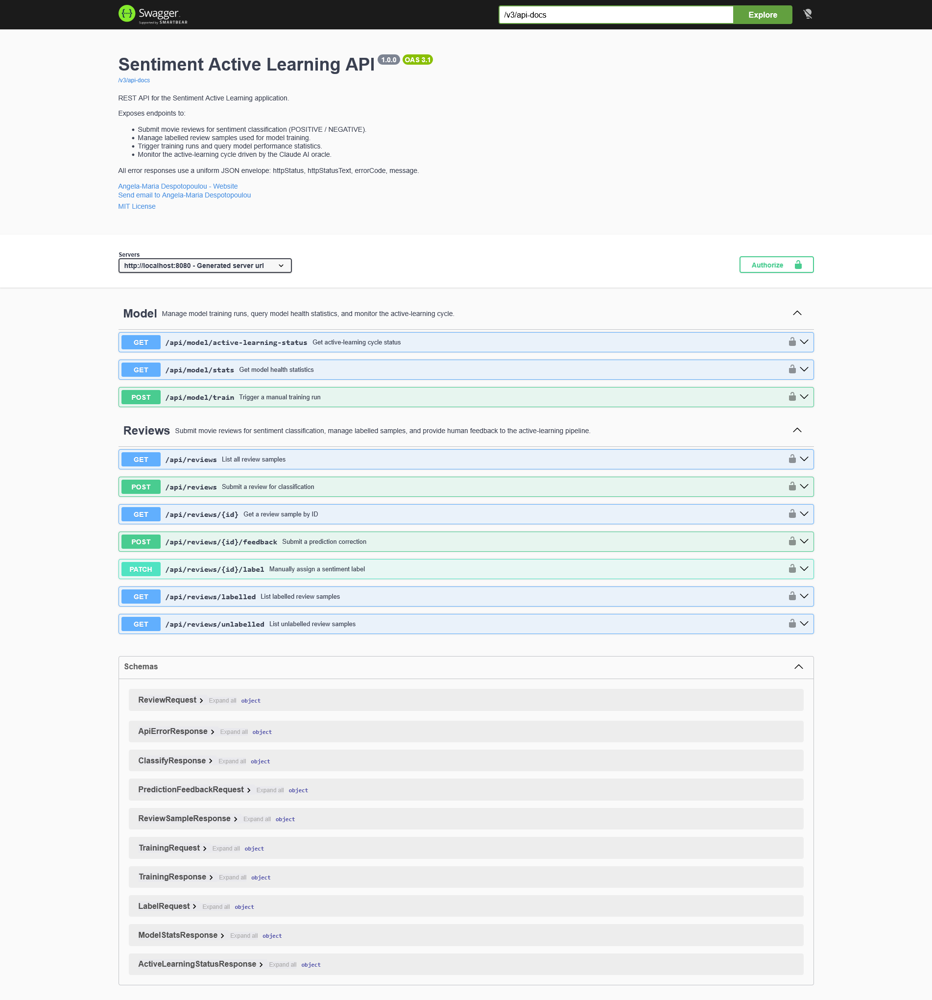

# sentiment-active-learning — Technical Guide

This is the Spring Boot application module of the
[java-spring-sentiment-active-learning](https://github.com/AngelaMariaDespotopoulou/java-spring-sentiment-active-learning)
repository.

For business context, algorithm explanation, and architecture overview see the
[root README](../README.md).

---

## 📋 Table of Contents

- [For Developers](#-for-developers)
  - [Prerequisites](#prerequisites)
  - [Project Structure](#project-structure)
  - [Running Locally (IDE)](#running-locally-ide)
  - [Configuration Reference](#configuration-reference)
  - [Package Structure](#package-structure)
  - [Key Design Decisions](#key-design-decisions)
  - [Adding a New Endpoint](#adding-a-new-endpoint)
- [For Deployers](#-for-deployers)
  - [Prerequisites](#prerequisites-1)
  - [Option A — Build and Run Locally with Docker](#option-a--build-and-run-locally-with-docker)
  - [Option B — Pull from DockerHub and Run](#option-b--pull-from-dockerhub-and-run)
  - [Publishing a New Image to DockerHub](#publishing-a-new-image-to-dockerhub)
  - [Environment Variable Reference](#environment-variable-reference)
  - [Volume and Model Persistence](#volume-and-model-persistence)
  - [Health Check](#health-check)
  - [Production Database](#production-database)
- [For Testers](#-for-testers)
  - [Swagger UI](#swagger-ui)
  - [Postman Collection](#postman-collection)
  - [Recommended Test Workflow](#recommended-test-workflow)
  - [API Endpoints Quick Reference](#api-endpoints-quick-reference)
  - [Error Codes Reference](#error-codes-reference)

---

## 👩‍💻 For Developers

### Prerequisites

- **JDK 21** or later ([Eclipse Temurin](https://adoptium.net/) recommended)
- **Maven 3.9+** (or use the Maven wrapper if present)
- **IntelliJ IDEA** or any Java IDE
- An **Anthropic API key** for Claude integration — [console.anthropic.com](https://console.anthropic.com/)

---

### Running Locally (IDE)

**Step 1 — Clone the repository**
```bash
git clone https://github.com/AngelaMariaDespotopoulou/java-spring-sentiment-active-learning.git
cd java-spring-sentiment-active-learning/sentiment-active-learning
```

**Step 2 — Create `application-dev.properties`**

This file is gitignored and must be created locally. Use the following as a template:

```properties
# Server
server.port=8080

# H2 in-memory database
spring.jpa.hibernate.ddl-auto=create-drop
spring.jpa.show-sql=true
spring.datasource.url=jdbc:h2:mem:sentiment_dev;DB_CLOSE_DELAY=-1;DB_CLOSE_ON_EXIT=FALSE
spring.datasource.driver-class-name=org.h2.Driver
spring.datasource.username=sa
spring.datasource.password=
spring.h2.console.enabled=true

# Swagger Basic Auth
swagger.auth.username=admin
swagger.auth.password=admin

# OpenAPI contact
api.contact.name=Angela-Maria Despotopoulou
api.contact.email=your-email@example.com
api.contact.url=https://github.com/AngelaMariaDespotopoulou

# Model persistence
active-learning.model-storage-path=./model/sentiment-model.ser
active-learning.retrain-on-startup=true
active-learning.staleness-threshold-samples=5

# Claude API key
claude.api.key=YOUR_CLAUDE_API_KEY_HERE

# Verbose logging for development
logging.level.io.github.amdespotopoulou=DEBUG
logging.level.org.hibernate.SQL=DEBUG
```

**Step 3 — Run the application**

In IntelliJ IDEA:
- Open `SentimentActiveLearningApplication.java`
- Right-click → **Run**
- Ensure the active Spring profile is set to `dev` in the run configuration

Or via Maven:
```bash
mvn spring-boot:run -Dspring-boot.run.profiles=dev
```

**Step 4 — Verify startup**

Visit `http://localhost:8080/actuator/health` — you should see `{"status":"UP"}`.

The startup log will report one of:
- `Model loaded from disk` — a saved model was found and is current
- `Startup training completed` — model was retrained from the database
- `Insufficient labelled samples — starting in untrained state` — normal for a fresh database

---

### Project Structure

```
src/main/java/io/github/amdespotopoulou/sentimentactivelearning/
├── api/
│   ├── controller/          ReviewController, ModelController
│   └── response/            ApiErrorResponse
├── commons/
│   ├── dto/
│   │   ├── request/         ReviewRequest, LabelRequest, TrainingRequest,
│   │   │                    PredictionFeedbackRequest
│   │   └── response/        ReviewSampleResponse, ClassifyResponse,
│   │                        TrainingResponse, ModelStatsResponse,
│   │                        ActiveLearningStatusResponse
│   ├── enums/               SentimentLabel, LabelSource, ErrorCode
│   └── mapper/              ReviewSampleMapper (MapStruct)
├── config/                  SecurityConfig, OpenApiConfig, ClaudeClientConfig,
│                            ClaudeProps, ActiveLearningProps, JpaAuditingConfig
├── exception/               GlobalExceptionHandler + all custom exceptions
├── persistence/
│   ├── dao/                 ReviewSampleDao (interface)
│   │   └── impl/            ReviewSampleDaoImpl
│   ├── entity/              ReviewSample
│   ├── listener/            ReviewSampleListener
│   └── repository/          ReviewSampleRepository
└── service/
    ├── core/                Classifier / ClassifierService
    │                        ModelTrainer / TrainingService
    │                        ActiveLearner / ActiveLearningService
    └── oracle/              ClaudeOracle / ClaudeOracleService
                             ClaudeRequestMapper
```

---

### Configuration Reference

All production configuration is defined in `application.properties` and resolved from environment variables. Development overrides live in `application-dev.properties` (gitignored).

| Property | Env Var | Default | Description |
|----------|---------|---------|-------------|
| `server.port` | `APP_PORT` | `8080` | HTTP port |
| `swagger.auth.username` | `SWAGGER_USERNAME` | — | Swagger UI Basic Auth username |
| `swagger.auth.password` | `SWAGGER_PASSWORD` | — | Swagger UI Basic Auth password |
| `claude.api.key` | `CLAUDE_API_KEY` | — | Anthropic API key |
| `active-learning.model-storage-path` | `MODEL_STORAGE_PATH` | — | Path to serialised model file |
| `active-learning.staleness-threshold-samples` | `MODEL_STALENESS_THRESHOLD` | `5` | New labels since last save before model is stale |
| `active-learning.uncertainty-threshold` | — | `0.65` | Confidence below which Claude is consulted |
| `active-learning.retrain-batch-size` | — | `10` | Oracle labels needed to trigger a retrain |
| `active-learning.min-training-samples` | — | `20` | Minimum labelled samples before training is allowed |
| `active-learning.retrain-on-startup` | — | `true` | Whether to attempt model restoration on startup |

---

### Package Structure

Every package has a `package-info.java` file with a full Javadoc description. Every public class and method has Javadoc. The build enforces zero Javadoc errors via the `maven-javadoc-plugin`.

---

### Key Design Decisions

**DAO pattern over direct repository injection**
Controllers and services depend on `ReviewSampleDao` (interface), never on `ReviewSampleRepository` (Spring Data). The DAO implementation adds duplicate-checking and existence-checking logic. If the persistence technology changes, only `ReviewSampleDaoImpl` needs updating.

**Interface-first services**
Every service is declared as an interface first (`Classifier`, `ModelTrainer`, `ActiveLearner`, `ClaudeOracle`) with a single production implementation. This enables unit testing without a trained model or a real Claude API key.

**Thread-safe model reference**
`ClassifierService` holds the trained model in an `AtomicReference<Model<Label>>`. Multiple HTTP request threads can classify concurrently while a retraining run is in progress. The model swap after retraining is atomic.

**`ApplicationReadyEvent` not `@PostConstruct`**
The startup model restoration sequence fires on `ApplicationReadyEvent`, which guarantees the JPA layer and datasource are fully initialised. `@PostConstruct` fires during bean initialisation and would fail to query the database.

**Model persistence format**
The trained `Model<Label>` is serialised to disk using Java's `ObjectOutputStream` alongside a `long` representing the labelled sample count at save time. At startup, the count difference is used to determine staleness.

---

### Adding a New Endpoint

1. Add the request/response DTOs in `commons/dto/request/` or `commons/dto/response/`
2. Add any new mapper methods to `ReviewSampleMapper`
3. Add the service method to the relevant interface (`ActiveLearner`, `ModelTrainer`)
4. Implement in the corresponding service class
5. Add the controller method to `ReviewController` or `ModelController` with full `@Operation` and `@ApiResponse` annotations
6. Update `package-info.java` if a new package is created
7. Run `mvn javadoc:javadoc` — zero errors required before committing

---

## 🐳 For Deployers

### Prerequisites

- **Docker Desktop** (or Docker Engine + Docker Compose plugin)
- A `.env.local` or `.env.hub` file with real values — see templates below
- An **Anthropic API key**

---

### Option A — Build and Run Locally with Docker

This option builds the image from source. The full source tree must be present.

**Step 1 — Create your environment file**
```bash
cp .env.local.template .env.local
# Edit .env.local and fill in CLAUDE_API_KEY and SWAGGER_PASSWORD
```

**Step 2 — Build and start**
```bash
docker compose -f docker-compose.local.yml up --build
```

Run in detached mode (background):
```bash
docker compose -f docker-compose.local.yml up --build -d
```

**Step 3 — Verify**
```bash
curl http://localhost:8080/actuator/health
# Expected: {"status":"UP"}
```

**Stop (preserves trained model):**
```bash
docker compose -f docker-compose.local.yml down
```

**Stop and delete trained model:**
```bash
docker compose -f docker-compose.local.yml down -v
```

---

### Option B — Pull from DockerHub and Run

This option pulls the pre-built image. No source code needed.

**Step 1 — Create your environment file**
```bash
cp .env.hub.template .env.hub
# Edit .env.hub and fill in DOCKERHUB_USERNAME, IMAGE_TAG,
# CLAUDE_API_KEY, and SWAGGER_PASSWORD
```

**Step 2 — Start**
```bash
docker compose -f docker-compose.hub.yml up -d
```

**Upgrade to a new image tag:**
```bash
# Edit IMAGE_TAG in .env.hub, then:
docker compose -f docker-compose.hub.yml up -d
```

**Pull the latest digest for the current tag:**
```bash
docker compose -f docker-compose.hub.yml pull
docker compose -f docker-compose.hub.yml up -d
```

---

### Publishing a New Image to DockerHub

```bash
# From the sentiment-active-learning/ directory
docker build -t amdespotopoulou/sentiment-active-learning:1.0.0 .
docker login
docker push amdespotopoulou/sentiment-active-learning:1.0.0
```

DockerHub repository: [hub.docker.com/u/amdespotopoulou](https://hub.docker.com/u/amdespotopoulou)

---

### Environment Variable Reference

| Variable | Required | Default | Description |
|----------|----------|---------|-------------|
| `APP_PORT` | No | `8080` | Host port and container port |
| `SPRING_PROFILES_ACTIVE` | No | `prod` | Spring profile — do not set to `dev` in Docker |
| `SWAGGER_USERNAME` | Yes | — | Swagger UI Basic Auth username |
| `SWAGGER_PASSWORD` | Yes | — | Swagger UI Basic Auth password |
| `CLAUDE_API_KEY` | Yes | — | Anthropic API key (`sk-ant-api03-...`) |
| `MODEL_STORAGE_PATH` | No | `/app/model/sentiment-model.ser` | Path inside the container |
| `MODEL_STALENESS_THRESHOLD` | No | `5` | New labels before model is stale at startup |
| `DOCKERHUB_USERNAME` | Hub only | — | DockerHub account username |
| `IMAGE_TAG` | Hub only | — | Image tag to pull (e.g. `1.0.0`) |

---

### Volume and Model Persistence

Both compose files create a named Docker volume for the trained model:

| Compose file | Volume name |
|-------------|-------------|
| `docker-compose.local.yml` | `sal-model-local` |
| `docker-compose.hub.yml` | `sal-model` |

The volume is mounted at `/app/model/` inside the container. The trained model file (`sentiment-model.ser`) is written here by `TrainingService` and read back at startup. The volume persists across container restarts and image upgrades — only `docker compose down -v` destroys it.

**⚠️ If the model file is missing on startup**, the application starts in an untrained state. Classification requests will return `409 MODEL_NOT_TRAINED` until a training run is triggered.

---

### Health Check

Both compose files and the `Dockerfile` define a health check:

```
GET /actuator/health  →  {"status":"UP"}
```

Docker checks every 30 seconds after a 45-second startup grace period. The container is marked `UNHEALTHY` after 3 consecutive failures, which triggers a restart under the `on-failure` / `unless-stopped` restart policies.

---

### Production Database

The application ships with **H2 in-memory** for development. For production, replace H2 with **MySQL** or **PostgreSQL**:

**1. Add the JDBC driver to `pom.xml`:**
```xml
<!-- MySQL -->
<dependency>
    <groupId>com.mysql</groupId>
    <artifactId>mysql-connector-j</artifactId>
    <scope>runtime</scope>
</dependency>

<!-- OR PostgreSQL -->
<dependency>
    <groupId>org.postgresql</groupId>
    <artifactId>postgresql</artifactId>
    <scope>runtime</scope>
</dependency>
```

**2. Add datasource properties** (via environment variables or `application-prod.properties`):
```properties
spring.datasource.url=jdbc:postgresql://db-host:5432/sentiment
spring.datasource.username=${DB_USERNAME}
spring.datasource.password=${DB_PASSWORD}
spring.jpa.hibernate.ddl-auto=validate
```

No entity or query changes are required — the JPA model and all JPQL queries are database-agnostic.

---

## 🧪 For Testers

### Swagger UI

The interactive API documentation is available at:
```
http://localhost:8080/swagger-ui/index.html
```

**Authentication:** HTTP Basic Auth. Default credentials: `admin` / `admin` (configurable via `SWAGGER_USERNAME` / `SWAGGER_PASSWORD`).

Click **Authorize 🔒** in the top right, enter your credentials, then use **Try it out** on any endpoint.



---

### Postman Collection

A complete Postman collection is available in [`../documentation/postman/`](../documentation/postman/):

| File | Description |
|------|-------------|
| `Sentiment-Active-Learning-API.postman_collection.json` | Full collection — all endpoints, test scripts, seed data |
| `SAL-Local-Dev.postman_environment.json` | Local environment (`localhost:8080`) |
| `SAL-Production.postman_environment.json` | Production environment template |

See [`../documentation/postman/README.md`](../documentation/postman/README.md) for step-by-step import instructions.

---

### Recommended Test Workflow

The application requires labelled data before it can classify. Follow these steps on a fresh start:

**Step 1 — Verify the application is running**
```
GET /actuator/health  →  {"status":"UP"}
```

**Step 2 — Seed the database**

Run the **🌱 Seed Data** folder in the Postman Collection Runner. This submits 20 pre-written reviews (10 positive, 10 negative) in one click.

Then label each seeded review using:
```
PATCH /api/reviews/{id}/label
Body: { "label": "POSITIVE" }  or  { "label": "NEGATIVE" }
```

Use `GET /api/reviews` first to find the assigned IDs.

**Step 3 — Train the model**
```
POST /api/model/train
Body: { "forceRetrain": false }
```
Expected response includes `"trained": true` and evaluation metrics.

**Step 4 — Submit a review for classification**
```
POST /api/reviews
Body: { "reviewText": "An absolute masterpiece. The direction was flawless." }
```

Expected response:
```json
{
  "label": "POSITIVE",
  "labelSource": "SEED",
  "confidenceScore": 0.94,
  "uncertain": false
}
```

**Step 5 — Monitor the active learning cycle**
```
GET /api/model/active-learning-status
GET /api/model/stats
```

---

### API Endpoints Quick Reference

#### Reviews

| Method | Path | Description |
|--------|------|-------------|
| `POST` | `/api/reviews` | Submit a review for classification |
| `GET` | `/api/reviews` | List all review samples |
| `GET` | `/api/reviews/labelled` | List labelled samples only |
| `GET` | `/api/reviews/unlabelled` | List unlabelled samples only |
| `GET` | `/api/reviews/{id}` | Get a specific review sample |
| `PATCH` | `/api/reviews/{id}/label` | Manually assign a label |
| `POST` | `/api/reviews/{id}/feedback` | Correct a wrong prediction |

#### Model

| Method | Path | Description |
|--------|------|-------------|
| `POST` | `/api/model/train` | Trigger a manual training run |
| `GET` | `/api/model/stats` | Get model health statistics |
| `GET` | `/api/model/active-learning-status` | Get active learning cycle status |

---

### Error Codes Reference

All errors use the uniform `ApiErrorResponse` envelope:

```json
{
  "httpStatus": 409,
  "httpStatusText": "Conflict",
  "errorCode": "MODEL_NOT_TRAINED",
  "message": "The model has not been trained yet."
}
```

| `errorCode` | HTTP | Trigger |
|-------------|------|---------|
| `VALIDATION_ERROR` | 400 | Field failed validation (blank, too long, null) |
| `INVALID_FIELD_VALUE` | 400 | Semantically invalid field value |
| `MALFORMED_REQUEST` | 400 | Invalid JSON or missing Content-Type |
| `REVIEW_NOT_FOUND` | 404 | No review exists for the given ID |
| `REVIEW_ALREADY_EXISTS` | 409 | Duplicate review text |
| `MODEL_NOT_TRAINED` | 409 | Classification before model is trained |
| `INSUFFICIENT_TRAINING_DATA` | 409 | Training with fewer samples than minimum |
| `CLAUDE_API_UNAVAILABLE` | 502 | Network error calling Anthropic Claude API |
| `CLAUDE_RESPONSE_INVALID` | 502 | Claude returned an unparseable response |
| `INTERNAL_ERROR` | 500 | Unexpected server-side error |

Full annotated JSON samples for all request and response models are in [`../data-model/`](../data-model/).

---

## 📚 Documentation Index

| Resource | Path |
|----------|------|
| Architecture diagrams (PlantUML + PNG) | [`../documentation/plantUML-diagrams/`](../documentation/plantUML-diagrams/) |
| Postman collection + environments | [`../documentation/postman/`](../documentation/postman/) |
| OpenAPI specification + Swagger screenshot | [`../documentation/swagger/`](../documentation/swagger/) |
| JSON samples for all API schemas | [`../data-model/`](../data-model/) |

---

## 👩‍💻 Author

**Angela-Maria Despotopoulou**
[github.com/AngelaMariaDespotopoulou](https://github.com/AngelaMariaDespotopoulou)

---

## 📄 License

[MIT License](../LICENSE.md)
